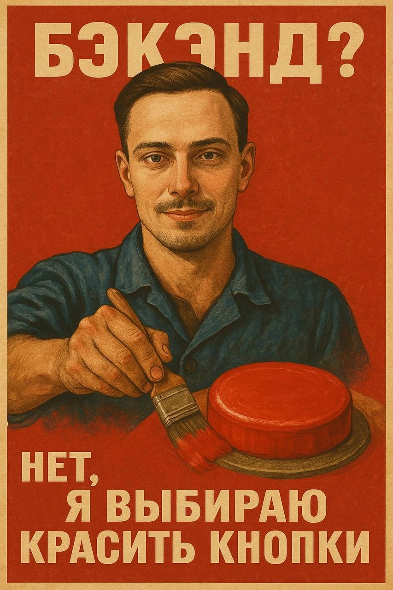

# 👋🏻 Привет

- 🧐 Фронтенд-инженер самоучка
- 🎓 Учусь в колледже по направлению _Information systems and programming_
- 

  
🔧 Стек технологий

  - HTML (HTML5)
  - CSS (CSS3), Sass (SCSS)
  - JavaScript (ES6+), TypeScript
  - Vue 3
  - Pinia
  - VueX
  - Vite
  - BEM, Accessibility, UX
  - Git (GitHub, GitLab)
  - Figma
  - PHP, Blade (basics)
  - Laravel 12.x (basics)
  

### 📺 Где со мной связаться

- <a href="https://t.me/bishep47" target="_blank"> Telegram</a>

